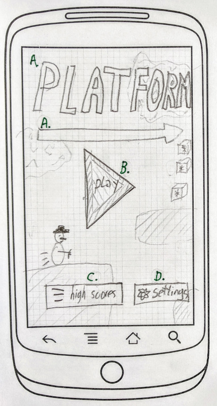
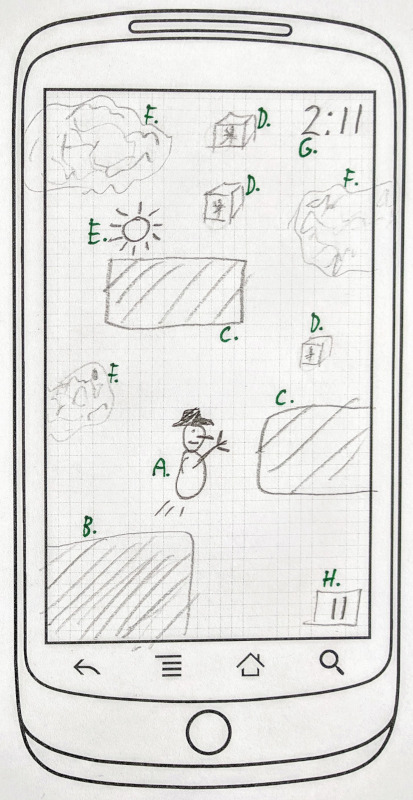

## Functioneel ontwerp / Functional design

`Platform` is a platform game about a snowman that races against time and heat. His goal is to stay in a frozen state for as long as possible. Power-ups such as ice cubes, freezing cells and ice cream will extend the deadline. But there are also enemies, like the sun, terrace heaters and heated buildings, that will speed-up defrosting.

### Example menu screen

This is the main activity, that is opened when tapping the app icon. It's the title screen and main menu.

- A. The logo/title.
- B. The play button. Tapping it will start [start gameplay](#example-gameplay-1). As pressing this button is the main things to do in this screen, it should look attractive. A subtle animation might help.
- C. The high scores button. Tapping it will navigate to the [high scores screen](#high-scores).
- D. The settings button. Tapping it will navigate to the [settings screen](#settings-scores).
- All unlabeled elements are a non-interactive version of the [gameplay](#example-gameplay-1). The game should be 'playing' automatically, possibly based on a prerecorded script. In order to obtain enough contrast with the foreground elements, the game may have to be faded to white or black a bit.

### Example gameplay 1

This section explains (part of) the actual game. There are multiple `gameplay` sections, each showing different entities that may be encountered in the game world. Which entity goes where, and how difficultly increases while playing, is determined by the [automatic level generator](#automatic-level-generator). 

- A. The snowman, our hero. The user can grab onto any point on the screen (except the pause button) and use it as a joystick, flying the snowman around. The snowman will move his arms (tree branches) in the flight direction, and should show comic-like thrust indicators behind him. Movement speed in any direction is limited to some (to be determined) constant. The hero has momentum, meaning it takes a while to change direction. Due to gravity, up-movement is relatively slow, while down-movement is relatively fast.
- B. Ground. A stationary blocking object, meaning the snowman cannot move through this and can stand on it.
- C. Platform. Like B, but floating.
- D. Ice cube. Stationary. Whenever the snowman touches an ice cube, the remaining play time is increased by a (yet to be determined) number of seconds. A sound and a visual effect should make this clear.
- E. Sun. Moves back and forth on a platform or ground. When the snowman comes within a certain (to be determined) range of a sun, his remaining play time should start decreasing rapidly.
- F. Background graphics. Doesn't do anything apart from looking nice. When the viewport scrolls, the background graphics scroll in the same direction, only slower. This creates [parallax effect](https://en.wikipedia.org/wiki/Parallax_scrolling). 
- G. Time remaining indicator. A minutes and seconds countdown timer. At game start, the timer begins at some number of seconds remaining. When the time runs out, it's [game over](#game-over). (The total game time determines to player's score.) The timer should start blinking and beeping 10s before expiring.
- H. Pause button. Pauses game play and opens the [pause menu](#pause-menu).
- Viewport. The viewport scrolls horizontally such that the snowman is always at 25% from the left.
