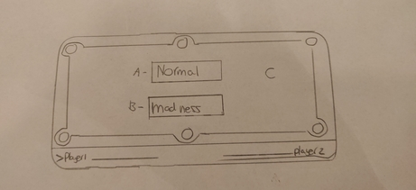
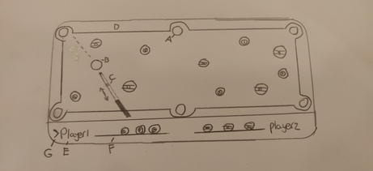

## Functioneel ontwerp 
**8 Ball Pool,** In de app wordt het turn based gespeeld door twee players.
In het spel zijn er 16 ballen. Deze ballen bestaan uit de witte cue bal,
solids en stripes. Speler 1 moet alle solids wegspelen en speler 2 moet alle stripes wegspelen.
Je speelt ballen weg als je ze in één van de 6 holes schiet van de pool table.
Er is maar één 8 ball.
De 8 ball mag pas als laatste worden weggespeeld. De speler die de 8 bal wegspeeld heeft het spel gewonnen.
De speler die te vroeg de 8 ball wegspeeld verliesd de game.

### Menu scherm
Als de app geopend word krijgt de gebruiker dit scherm als eerste gezien. Er zijn geen ballen en je kan nog niks spelen.

  
- A. De normal (normaal) knop start de normale versie van de game
- B. De madness knop start de madness versie van de game
- C. Alle achtergrond elementen zijn inactief en er zullen geen ballen aanwezig zijn.
### Normaal 8 ball pool

- A. 
- B.
- C.
- D. 
- E. 
- F. 
- G. 

### Maddness 8 ball pool