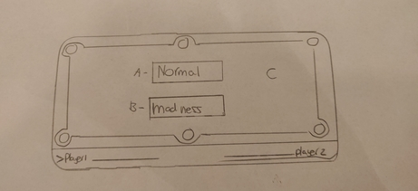
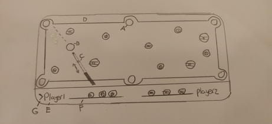
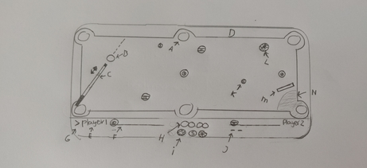
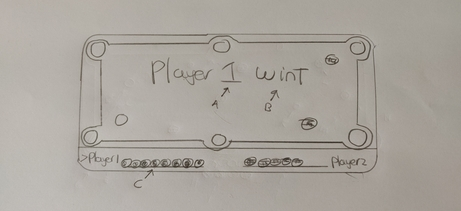

# Functioneel ontwerp 
## Beschrijving

### 8 Ball Pool (Normal mode)

In de app wordt het turn based gespeeld door twee players.
In het spel zijn er 16 ballen. Deze ballen bestaan uit de witte cue bal, de 8 ball,
solids en stripes. Speler 1 moet alle solids wegspelen en speler 2 moet alle stripes wegspelen.
Je speelt ballen weg als je ze in één van de 6 pockets schiet van de pool table. Als je een bal weg speelt blijft de beurt bij jou.
Er is maar één 8 ball.
De 8 ball mag pas weg gespeeld worden als je al jouw ballen hebt weggespeeld, bijvoorbeeld alle solids. De speler die de 8 bal wegspeeld heeft het spel gewonnen.
De speler die te vroeg de 8 ball wegspeeld verliest de game.
De cue ball wordt geschoten met een cue. Hoe verder je de cue naar achter trekt,
hoe krachtiger de bal weggeschoten zal worden.

### Madness Mode

Madness mode is 8 Ball pool (Normal mode) met powerups. Deze powerups kunnen neutraal positief of negatief zijn.
De positieve powerups zullen je helpen om het spel te winnen.
De negatieve kunnen je het spel moeilijker maken door jou in de weg te zitten of door de andere speler een voordeel te geven.
De neutrale powerups kunnen je tegenwerken, maar als je ze goed gebruikt kunnen ze je ook helpen het spel te winnen.
Powerup pickups spawnen op de pool table. Als je met de cue ball over die pickup gaat dan zal de powerup meteen activeren.
Powerups die op de pool table spawnen zullen op een random plek spawnen op de pool table.
Powerups blijven voor de komende twee rondes actief.

#### Muren

In madness kan je muren krijgen. Deze muren kan je plaatsen op de pool table.
Je kan ze gebruiken om de andere speler te blokeren maar
je kan ze ook gebruiken om een bal te kaatsen in een richting waarin je normaal de bal niet kan krijgen.
Als de andere speler een bal scoort krijg jij een muur.
Je hebt dan 30 seconden om die muur te plaatsen voordat de andere speler weer mag schieten.
Muren kunnen niet te dicht op de pockets geplaatst worden.

#### Positieve powerups
+ **Ball remove,** deze powerup haalt een bal van jou weg zodat je er één minder hoeft weg te spelen.
+ **Gravity aan ball,** als de bal in de buurt van een pocket komt wordt de bal erin getrokken.
+ **No drag,** Voor een bepaalde hoeveelheid tijd zullen de ballen niet afremmen. 

#### Negatieve powerups
+ **Add ball,** er wordt een bal toegevoegd die je moet wegspelen voordat je de 8 Ball mag wegspelen.
+ **More drag,** de ballen zullen harder afremmen waardoor ze minder ver zullen rollen.
+ **More walls to enemy,** de tegenstander krijgt één extra muur om te plaatsen.

#### Neutrale powerups
+ **Speed boost,** met deze powerup zal je de bal twee keer zo hard schieten. Deze powerup stackt.
+ **Random,** hieruit krijg je een random powerup.
+ **Gravity well,** een gravity well trekt ballen in een bepaalde range naar zich toe. Dit kan je gebruiken om ballen te
sturen in een bepaalde richting. maar het kan ook de je bal in de verkeerde richting sturen.
Als een bal erg langzaam gaat en in een gravity well komt zal die vast komen te zitten in de gravity well.
+ **Worm hole,** bij de worm hole komen er twee holes op de pool table. Als er een bal in één van die holes
komt dan wordt de bal geteleporteerd naar de andere hole.

## Schetsen

## Menu scherm
Als de app geopend word krijgt de gebruiker dit scherm als eerste gezien. Er zijn geen ballen en je kan nog niks spelen.

  
- A. De normal (normaal) knop start de normale versie van de game
- B. De madness knop start de madness versie van de game
- C. Alle achtergrond elementen zijn inactief en er zullen geen ballen aanwezig zijn.

## Normaal 8 ball pool
Zodra de gebruiker op de Normal mode heeft geklikt zal deze versie van de game opstarten.

- A. Een pocket hier scoren de spelers.
- B. Een bal. De witte wordt gebruikt om mee te spelen. De 8Ball mag pas als laatst en de solid en de striped worden weggespeeld.
- C. De cue. Hiermee wordt de kracht bepaald van het wegschieten en kan er een richting gegeven worden aan de witte bal.
- D. De randen van het bord.
- E. De kant van player 1, player 2 heeft alles identiek.
- F. De shelf waar de ballen zichtbaar zijn die gescoord zijn.
- G. De aanduiding wie er aan de beurt is.

## Madness 8 ball pool
Zodra de gebruiker op de Madness mode heeft geklikt zal deze versie van de game opstarten.

- A. Een pocket hier scoren de spelers.
- B. Een bal. De witte wordt gebruikt om mee te spelen. De 8Ball mag pas als laatst en de solid en de striped worden weggespeeld.
- C. De cue. Hiermee wordt de kracht bepaald van het wegschieten en kan er een richting gegeven worden aan de witte bal.
- D. De randen van het bord.
- E. De kant van player 1, player 2 heeft alles identiek.
- F. De shelf waar de ballen zichtbaar zijn die gescoord zijn.
- G. De aanduiding wie er aan de beurt is. 
- H. De timer voor het plaatsen van de muren. Standaard tijd is 30 seconden
- I. De actieve powerups.
- J. Het aantal muur segmenten die de player kan plaatsen
- K. Een power up.
- M. Een muur segment die geplaatst is.
- N. Een indicator waar niet een muur segement geplaatst kan worden.

## Gewonnen of verloren
Als 1 van de gebruikers alle ballen en de 8 ball heeft weggespeeld dan heeft hij/zij gewonnen.

- A. De aanduiding welke speler gewonnen heeft. Dit kan 1 of 2 zijn
- B. De taal waarin het apparaat staat maakt uit. Hier staat dan wint in de betreffende taal.
- C. De gebruiker die gewonnen heeft kan ook daadwerkelijk zien dat hij/zij gewonnen heeft. Dit wordt gereset als de speler het scherm aanraakt. dan komt de gebruiker weer terug op het menu scherm.