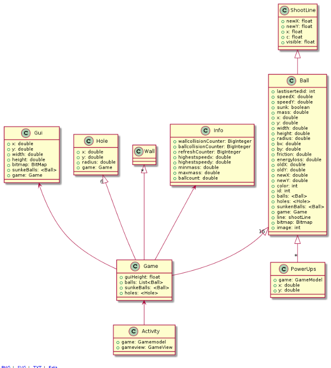

## Technisch ontwerp / Technical design
## klasse diagrammen:
  
Dit klasse diagram beschrijft de interactie met de library. 

  
Dit klasse diagram beschrijft de onderlinge interactie tussen de Pool Game classes.
## Domein Model:
  
Dit domein model beschrijft de onderlinge interactie tussen de pool game classes.

Hierbij is **Activity** verantwoordelijk voor het aanmaken van de Game instantie en hoe je game reageert op status veranderingen.
**Game** verantwoordelijk voor het aanmaken van alle entiteiten en het beheren van het spel. 
**Gui** is verantwoordelijk voor het beheren van de user interface.
**Hole** verantwoordelijk voor het beheren van de de gaten in de pooltafel. 
**Wall** verantwoordelijk voor het beheren van de muren die de user kan plaatsen op de pooltafel. 
De **Info** class die gebruikt voor het debuggen. 
De **Ball** class beheert de ballen die op de pooltafel liggen.
**PowerUps** is verantwoordelijk voor de extra powers die de gebruiker kan gebruiken. Verder kan de word de ShootLine class gebruikt voor het beheren van de pool que waarmee de pool ballen in beweging brengt.

Realisatie:
De pool game zal gemaakt/geschreven worden met android studio hiervoor gebruiken wij de taal JAVA. 

Beschrijving classes:

1 Activity:

1.1 OnCreate:
Geeft aan wat de gameview (canvas) is een maakt een nieuwe “Game” instance aan.

1.2 OnSaveInstanceState:
…..?

1.3 onResume:
Start(resumed) de game als de methoden aangeroepen wordt.

1.4 onPause:
Stop de game als de methoden word aangeroepen.

2 Ball:

2.1 checkCollisionBall:
Controleert op collision tussen de poolballenen handeld verder af hoe de poolballen op deze collision reageren.

2.2 checkMovement:
Controleert of de poolballen stilstaan of in beweging zijn.

2.3 checkCollisionWall:
Controleert of de poolballen een collision hebben met de wall, deze methoden zorgt er verder ook voor dat de poolballen niet van de pooltafel af kunnen.

2.4 checkCollisionHole:
Controleert of de poolballen een collision hebben met de gaten “pockets” van de pooltafel. 

2.5 Tick:
Deze methoden wordt 180 keer per seconden uitgevoerd (180 ticks) en roept elke tick de checkMovement, checkCollisionWall, checkCollisionBall en de checkCollisionHole methoden aan.

2.6 handleTouch:
Deze methoden is verantwoordelijk voor het afhandelen van alle input. En het “tekenen” van een lijn “stoot stok” waarmee vervolgens een poolbal mee afgeschoten kan worden.

2.7 draw
Word elke keer als het scherm refresht aangeroepen (60 keer per seconden) en plaatst alle pool ball entities met bijbehorende foto.

3 Game:

3.1  getPlayHeight:
Returned de hoogte van het huidige scherm.

3,2 getPlayWidth:
Returned de breedte van huidige scherm:

Start:
Creëert een nieuwe Gui, ShootLine en Hole entities en 16 verschillende ball entities.

4 Gui:

4.1 getX:
Returned de huidige X waarde (coordinaat).

4,2 getY:
Returned de huidige Y waarde (coordinaat).

4.3 getWidth:
Returned de breedte van huidige scherm:

4.4 getHeight:
Returned de hoogte van het huidige scherm.

4.5 draw:
Word elke keer als het scherm refresht aangeroepen (60 keer per seconden) 
……..?

5 Hole:

De hole class extends de Entity class, en Overrides de public void draw(GameView) methode hiervan, verder bevat hij de overige functies:

5.1: Hole(Game game, double x, double y):
De constructor van de class, initialiseert het private Game object in de class, 
tevens initialiseert hij de x en y doubles.

5.2 getX():
Geeft de x positie van de Hole terug als een double.

5.3 getY():
Geeft de y positie van de Hole terug als een double.

5.4 getRadius():
Geeft de straal van de bal terug als een double.

5.5 draw(GameView gv):
Tekent de Hole op het scherm.

6 Info:

De Info class beschrijft een aantal properties van de Ball objecten, houdt bij hoe vaak de balls gebotst zijn tegen andere ballen (in totaal), en hoe vaak ze tegen de muren zijn gebotst (de randen van het pool veld).

6.1 addToWallCollisionCounter():
Voegt een big integer waarde toe aan de public static BigInteger variabele genaamd ‘wallcollisionCounter’.

6.2 addToBallCollisionCounter():
Voegt een big integer waarde toe aan de public static BigInteger variabele genaamd ‘ballcollisionCounter’.

6.3 addToRefreshCounter():
Voegt een big integer waarde toe aan de public static BigInteger variabele genaamd ‘refreshCounter’.

6.4 updateHighestSpeedX(ArrayList<Ball> balllist):
Loopt alle ballen af en vergelijkt voor elke bal of de huidige snelheid hoger is dan de hoogst waargenomen snelheid op de x-as, indien dit het geval is, zal de hoogst waargenomen snelheid worden geupdatet.

6.5 updateHighestSpeedY(ArrayList<Ball> balllist):
Doet hetzelfde als updateHighestSpeedX, maar dan voor de hoogst waargenomen snelheid op de y-as.

6.6 getLowestMass(ArrayList<Ball> balllist):
Berekent de massa van de lichtste bal en slaat deze in public static double minmass op.

6.7 getHighestMass(ArrayList<Ball> balllist):
Berekent de massa van de zwaarste bal en slaat deze in public static double maxmass op.

6.8 getBallCount(ArrayList<Ball> balllist):
Geeft het aantal ballen terug in de meegegeven ArrayList<Ball> genaamd ‘balllist’.

7 ShootLine:

De ShootLine class extends de Entity class en beschrijft de lijn die voor de witte bal getekend wordt.
Hij bevat een vector waarin de kracht en richting worden beschreven waarmee de witte bal weg zal worden geschoten wanneer de gebruiker zijn vinger van het scherm verwijderd. 
De kracht is hierbij de lengte van de lijn.
Ook bevat hij functies voor het verplaatsen van deze lijn in de game-loop en voor het veranderen van het feit of de lijn wel of niet zichtbaar is.

7.1 ShootLine(boolean visible):
De constructor van de class, initialiseert de private boolean ‘visible’.

7.2 draw(GameView gv):
Tekent de witte lijn op het scherm, met als origin x en y, en als eindpositie newX en newY.

7.3 setX(float x):
Sets de private x float in de class.

7.4 setY(float y):
Sets de private y float in de class.

7.5 setVisible(boolean visible):
Sets de private visible boolean in de class.

7.6 getVisible():
Geeft een boolean terug welke aangeeft of de witte lijn op dit moment getekend moet worden of niet.
7.7 setNewX(float newX):
Sets de private newX float, wordt gebruikt wanneer de user het scherm aanraakt, of zijn vinger verplaatst.

7.8 setNewY(float newY):
Sets de private newY float, wordt gebruikt wanneer de user het scherm aanraakt, of zijn vinger verplaatst.

8 Utility:

Class met methodes voor het berekenen van bepaalde afstanden en het genereren van willekeurige waarden.

8.1 getDistance(double x1, double y1, double x2, double y2):
Berekent de afstand tussen twee posities met de stelling van pythagoras, geeft de afstand in het kwadraat terug als een double.

8.2 getXDistance(double x1, double x2):
Berekent de afstand tussen twee x posities en geeft het antwoord terug als een double.

8.3 getYDistance(double y1, double y2):
Berekent de afstand tussen twee y posities en geeft het antwoord terug als een double.

8.4 randomDoubleFromRange(double min, double max):
Genereert een willekeurige double waarde tussen de gespecificeerde min en max waarden.

